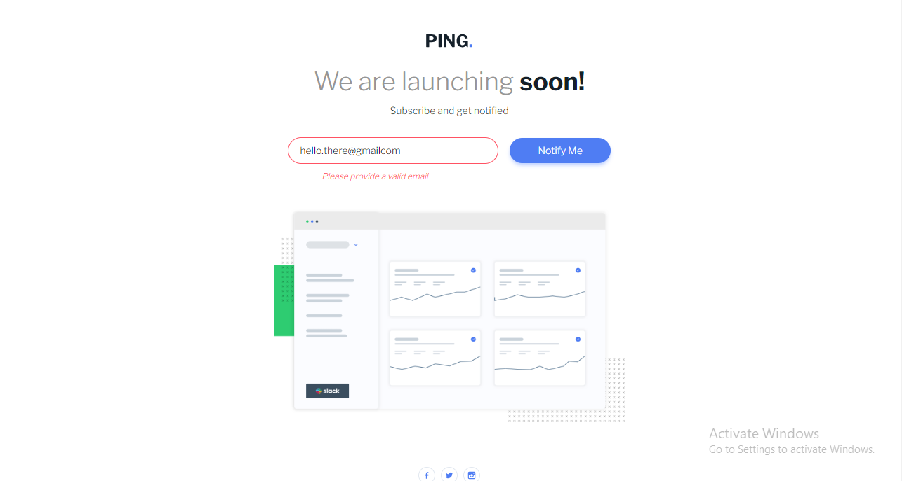

# Frontend Mentor - Ping coming soon page solution

This is a solution to the [Ping coming soon page challenge on Frontend Mentor](https://www.frontendmentor.io/challenges/ping-single-column-coming-soon-page-5cadd051fec04111f7b848da). Frontend Mentor challenges help you improve your coding skills by building realistic projects. 

## Table of contents

- [Overview](#overview)
  - [The challenge](#the-challenge)
  - [Screenshot](#screenshot)
  - [Links](#links)
- [My process](#my-process)
  - [Built with](#built-with)
  - [What I learned](#what-i-learned)
  - [Continued development](#continued-development)
  - [Useful resources](#useful-resources)
- [Author](#author)
- [Acknowledgments](#acknowledgments)

**Note: Delete this note and update the table of contents based on what sections you keep.**

## Overview

### The challenge

Users should be able to:

- View the optimal layout for the site depending on their device's screen size
- See hover states for all interactive elements on the page
- Submit their email address using an `input` field
- Receive an error message when the `form` is submitted if:
	- The `input` field is empty. The message for this error should say *"Whoops! It looks like you forgot to add your email"*
	- The email address is not formatted correctly (i.e. a correct email address should have this structure: `name@host.tld`). The message for this error should say *"Please provide a valid email address"*

### Screenshot



### Links

- Solution URL: [ping coming soon solution](https://github.com/Scaarif/playground)
- Live Site URL: [ping coming soon live](https://scaarif.github.io/playground/)

## My process

### Built with

- Mobile-first workflow
- [React](https://reactjs.org/) - JS library
- [Tailwind css](https://tailwindcss.com/) - CSS framework

### What I learned

Deploying the solution to github pages. Took me a minute (ok, quite some time) to figure out how to. The learning moment:
- Figuring out that without ``` import React from 'react' ``` which I had noted/concluded was not necessary with _vite_ was necessary for the deployment to work: Other wise I ended up with a blank page since main.jsx was not discoverable (_had a **404** on inspection_)
- Tried deploying with **Github actions** which failed - that's still something I need to figure out. That and **YAML**


### Continued development

### Useful resources

- [Deploying a vite app to Github pages](https://dev.to/rashidshamloo/deploying-vite-react-app-to-github-pages-35hf) - This helped me figure out how to deploy to github pages using __gh-pages__ after my attempt to using __Github actions__ failed. It's simple and straight to the point.

## Author

- Frontend Mentor - [@Scaarif](https://www.frontendmentor.io/profile/Scaarif)
- Twitter - [@ScaarifN](https://www.twitter.com/ScaarifN)

## Acknowledgments
